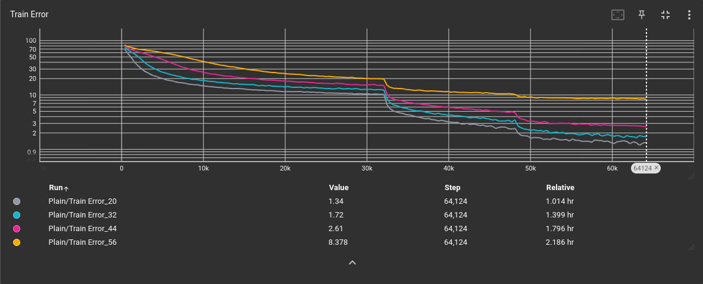
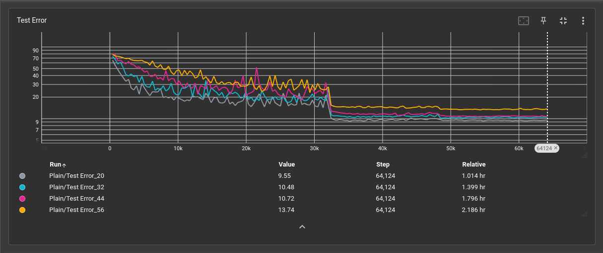
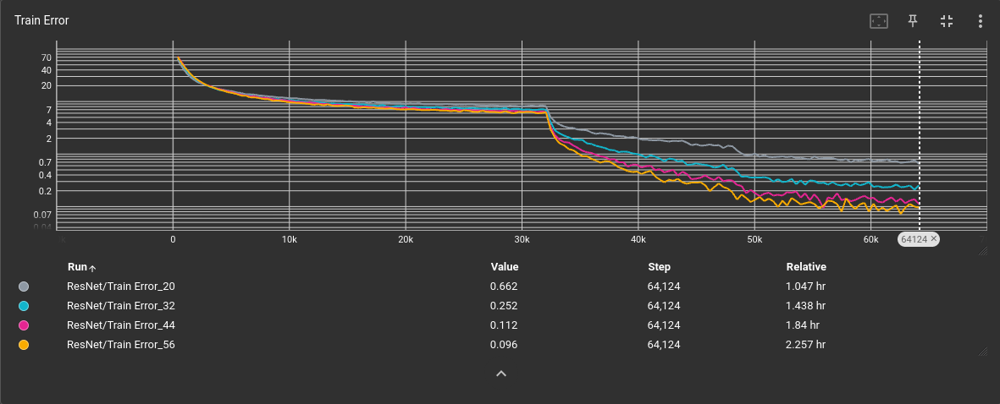
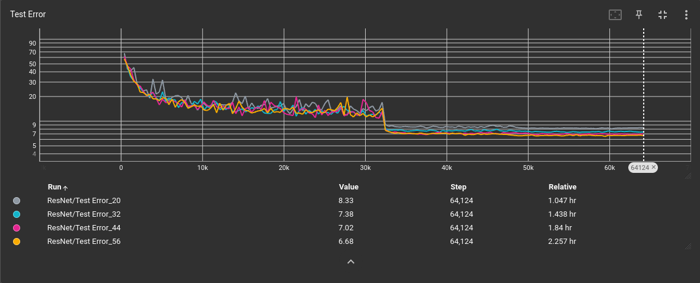

# ResNet
<b>Implementation</b>

My code in <a href=https://github.com/redonovan/ResNet/blob/main/resnet.py>resnet.py</a> is implemented in PyTorch 1.11.0 directly from the ResNet paper (<a href=https://arxiv.org/abs/1512.03385>He, et al. 2015</a>).  

My code follows Section 4.2 of the paper and is trained on the CIFAR-10 image dataset.

My plain network results are similar to those in the paper (Figure 6, left) with deeper networks having higher error:

My ResNet results are also similar to those in the paper (Figure 6, middle) with deeper networks now having lower error:

It should be noted that it required 6 attempts to get the 56-layer network to work this well; the first 5 attempts all had a much higher training error from 0-10k steps.
